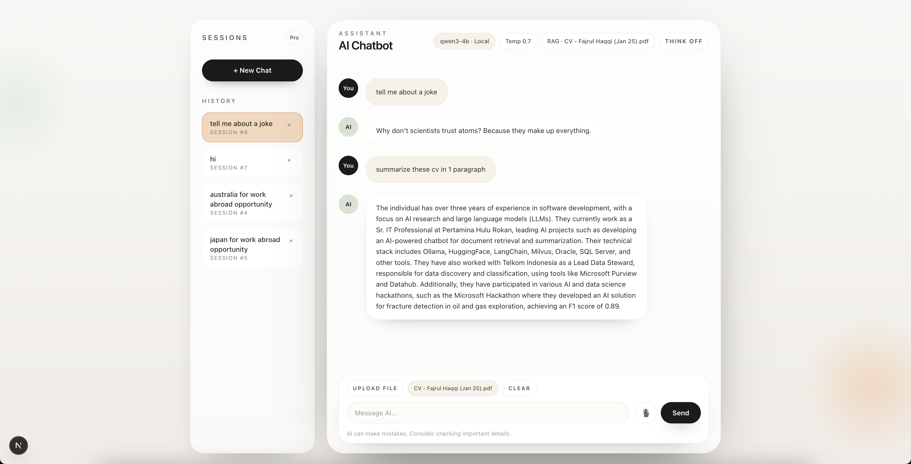

# Local AI Chatbot (LM Studio + RAG + Voice)

A Next.js chatbot that runs entirely on your machine using LM Studio. It supports retrieval-augmented generation (RAG) from uploaded files, optional reasoning display, and real-time voice input/output for hands-free conversations.

## Features

- Local LLM streaming via LM Studio (no cloud dependency).
- RAG: upload a document to ground answers in your content.
- Voice input (speech-to-text) and voice output (text-to-speech).
- Optional `<think>` display with collapsible reasoning panel.
- Clean, modern UI optimized for demos.

## Tech Stack

- Next.js (App Router) + React + TypeScript
- LM Studio local server
- PDF parsing via `pdfjs-dist`
- Speech Recognition + Speech Synthesis (browser APIs)

## Requirements

- Node.js 18+ (recommended)
- LM Studio installed

## LM Studio Setup

1. Install LM Studio: https://lmstudio.ai
2. Download a chat model:
   - Recommended: `qwen3-4b`
3. Start the local server in LM Studio:
   - Enable the OpenAI-compatible server
   - Default base URL: `http://localhost:1234`

Optional (for RAG embeddings):
- Recommended embedding model: `nomic-ai/nomic-embed-text-v1.5-GGUF`

These model names are used in the API routes and can be changed if you prefer other local models.

## Getting Started

Install dependencies and run the app:

```bash
npm install
npm run dev
```

Open `http://localhost:3000` in your browser.

## Usage

- Send messages directly or toggle conversation mode for voice.
- Upload a `.txt`, `.md`, `.csv`, `.json`, or `.pdf` file to enable RAG.
- Toggle “Think” to show or hide model reasoning.

## Demo


- Recording: [click here](demo.mp4)

## Project Structure

- `src/app/page.tsx`: UI, voice features, streaming rendering.
- `src/app/api/chat/route.ts`: LM Studio chat streaming proxy.
- `src/app/api/rag/route.ts`: RAG pipeline (chunking, embeddings, top-k, chat).

## Notes

- Voice features rely on browser support for Speech Recognition and Speech Synthesis.
- LM Studio must be running for responses to stream.
